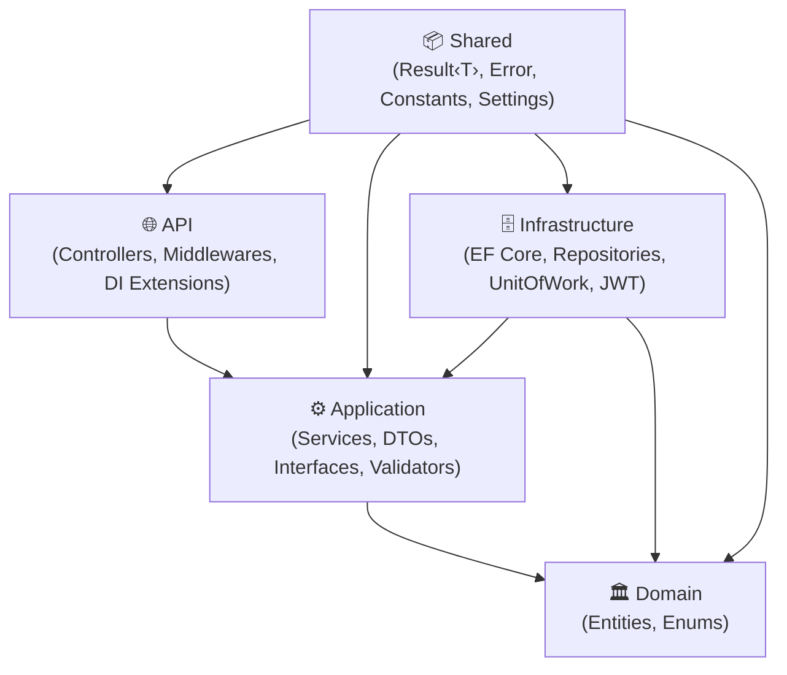
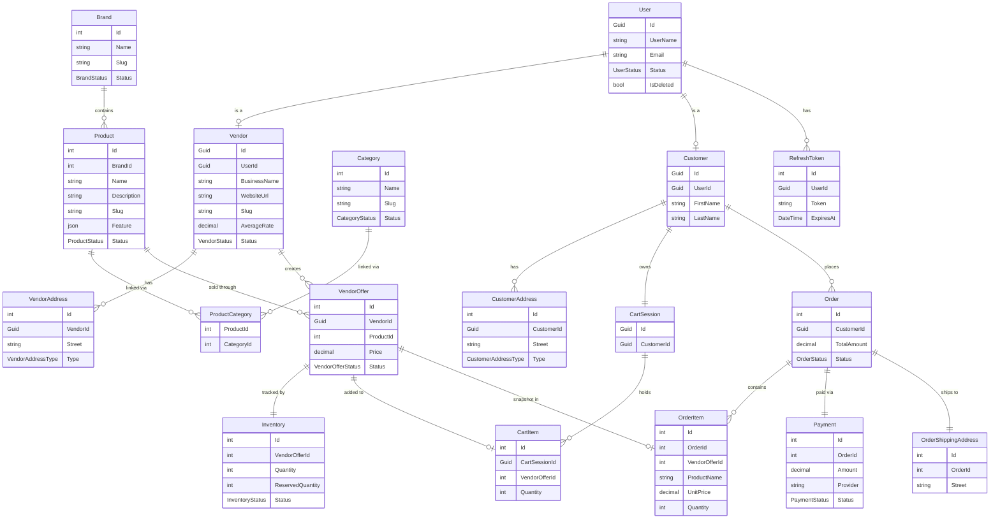
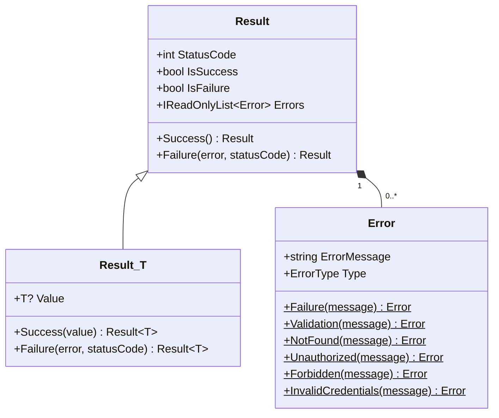
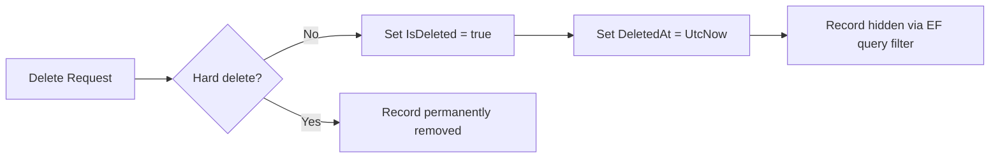

# Multi-Vendor E-Commerce API

> A scalable and modular **Multi-Vendor E-Commerce Backend API** built with **ASP.NET Core 8**, **Entity Framework Core**, and **PostgreSQL** — following a clean 5-layer architecture.

---

## Table of Contents

- [Overview](#overview)
- [Tech Stack](#tech-stack)
- [Architecture](#architecture)
- [Project Structure](#project-structure)
- [Domain Model](#domain-model)
- [Key Relationships](#key-relationships)
- [Request Flow](#request-flow)
- [Result Pattern](#result-pattern)
- [Features](#features)
- [API Endpoints](#api-endpoints)
- [Soft Delete Strategy](#soft-delete-strategy)
- [Design Decisions](#design-decisions)
- [Getting Started](#getting-started)
- [Testing](#testing)
- [Future Improvements](#future-improvements)

---

## Overview

This project simulates a real-world e-commerce backend where:

- **Multiple vendors** can register and sell products under their own pricing and inventory.
- **Customers** can browse products, manage a cart, place orders, and track payments.
- **Admins** can manage users, roles, and platform data.

Built as a learning project with production-grade considerations: clean architecture, the Result pattern, soft deletes, JWT + refresh token auth, and structured logging.

---

## Tech Stack

| Layer          | Technology                     |
| -------------- | ------------------------------ |
| Framework      | ASP.NET Core 8 Web API         |
| Language       | C# 12                          |
| ORM            | Entity Framework Core 8        |
| Database       | PostgreSQL (via Npgsql)        |
| Authentication | ASP.NET Core Identity + JWT    |
| Validation     | FluentValidation               |
| Mapping        | AutoMapper                     |
| Logging        | Serilog (file sink)            |
| Testing        | xUnit + Moq + FluentAssertions |

---

## Architecture

The solution follows a **5-layer Clean Architecture** where dependencies flow inward:

```
API  →  Application  →  Domain
                ↑
         Infrastructure
                ↑
             Shared
```



### Layer Responsibilities

| Layer              | Responsibility                                                              |
| ------------------ | --------------------------------------------------------------------------- |
| **Domain**         | Pure entities and enums — zero infrastructure dependencies                  |
| **Application**    | Business logic services, DTOs, service/repository interfaces                |
| **Infrastructure** | EF Core `DbContext`, repositories, `UnitOfWork`, JWT & cookie services      |
| **API**            | HTTP controllers, middleware, DI registration extension methods             |
| **Shared**         | `Result<T>`, `Error`, constants, settings, enums — referenced by all layers |

---

## Project Structure

```
Multi Vendor E-Commerce APIs/
├── src/
│   ├── MultiVendorECommerce.API/
│   │   ├── Controllers/          # AuthController, ProductController, ...
│   │   ├── Extensions/           # DI extension methods
│   │   ├── Logging/              # IAppLogger<T> abstraction + AppLogger
│   │   ├── Middlewares/          # Global exception handler
│   │   └── Program.cs
│   │
│   ├── MultiVendorECommerce.Application/
│   │   ├── Services/             # AuthService, ProductService, BrandService, ...
│   │   ├── DTOs/                 # Feature-scoped DTOs (Auth/, Product/, ...)
│   │   ├── Interfaces/           # IUnitOfWork, IProductService, ...
│   │   ├── Profiles/             # AutoMapper profiles
│   │   └── Validators/           # FluentValidation validators
│   │
│   ├── MultiVendorECommerce.Domain/
│   │   ├── Models/               # 22 entity classes
│   │   └── Enums/                # OrderStatus, UserStatus, VendorStatus, ...
│   │
│   ├── MultiVendorECommerce.Infrastructure/
│   │   ├── Contexts/             # ECommerceDbContext
│   │   ├── Configurations/       # IEntityTypeConfiguration<T> per entity
│   │   ├── Repositories/         # BaseRepository + 17 concrete repositories
│   │   ├── UnitOfWork/           # UnitOfWork with lazy-loaded repositories
│   │   ├── Services/             # TokenService, CookieService
│   │   ├── Seeds/                # Database seed data
│   │   └── Migrations/
│   │
│   └── MultiVendorECommerce.Shared/
│       ├── Results/              # Result, Result<T>
│       ├── Helpers/              # Error factory class
│       ├── Enums/                # ErrorType
│       ├── Constants/            # Roles, etc.
│       └── Settings/             # Strongly-typed settings classes
│
└── test/
    ├── MultiVendorECommerce.Application.Test/
    │   ├── AuthServiceTest/
    │   ├── BrandServiceTest/
    │   ├── CategoryServiceTest/
    │   ├── ProductServiceTest/
    │   ├── ProductCategoryServiceTest/
    │   ├── VendorOfferServiceTest/
    │   └── ValidatorTest/
    ├── MultiVendorECommerce.API.Test/
    └── MultiVendorECommerce.Infrastructure.Test/
```

---

## Domain Model

The full entity graph for the platform:



---

## Key Relationships

| Relationship                     | Type        | Notes                                       |
| -------------------------------- | ----------- | ------------------------------------------- |
| `User` → `Vendor` / `Customer`   | 1 : 0..1    | One user can be a vendor or customer        |
| `User` → `RefreshToken`          | 1 : many    | Supports multi-device sessions              |
| `Vendor` → `VendorOffer`         | 1 : many    | Each vendor lists their own offers          |
| `VendorOffer` → `Inventory`      | 1 : 1       | Stock tracked per offer                     |
| `Product` ↔ `Category`           | many : many | Through `ProductCategory` join table        |
| `Customer` → `CartSession`       | 1 : 1       | One active cart per customer                |
| `CartSession` → `CartItem`       | 1 : many    | Multiple items in a cart                    |
| `Customer` → `Order`             | 1 : many    | A customer can have multiple orders         |
| `Order` → `OrderItem`            | 1 : many    | Snapshot of offer price at time of purchase |
| `Order` → `Payment`              | 1 : 1       | One payment per order                       |
| `Order` → `OrderShippingAddress` | 1 : 1       | Shipping address snapshot per order         |

---

## Request Flow

A typical API request travels through these layers:

```mermaid
sequenceDiagram
    participant Client
    participant Controller as API Controller
    participant Service as Application Service
    participant UoW as Unit of Work
    participant Repo as Repository
    participant DB as PostgreSQL

    Client->>+Controller: HTTP Request
    Controller->>+Service: Call service method
    Service->>+UoW: Access repository
    UoW->>+Repo: Query / Command
    Repo->>+DB: EF Core SQL
    DB-->>-Repo: Data
    Repo-->>-UoW: Entity
    UoW-->>-Service: Entity
    Service-->>-Controller: Result&lt;DTO&gt;
    Controller-->>-Client: HTTP Response (StatusCode + Result)
```

---

## Result Pattern

All service methods return `Result<T>` — never throw exceptions for expected failures.



**Usage example in a service:**

```csharp
public async Task<Result<BrandDTO>> GetByIdAsync(int id)
{
    var brand = await _unitOfWork.Brands.GetByIdAsync(id);
    if (brand is null)
        return Result<BrandDTO>.Failure(Error.NotFound("Brand not found."));

    var dto = _mapper.Map<BrandDTO>(brand);
    return Result<BrandDTO>.Success(dto);
}
```

**Controller always delegates the status code:**

```csharp
[HttpGet("{id:int}")]
public async Task<ActionResult<Result<BrandDTO>>> GetById(int id)
{
    var result = await _brandService.GetByIdAsync(id);
    return StatusCode(result.StatusCode, result);
}
```

---

## Features

### Authentication & Authorization

- Register / Login with JWT access token + HTTP-only refresh token cookie
- Role-based access control: `Admin`, `Vendor`, `Customer`
- Refresh token rotation and revocation

### Vendor System

- Vendor profile: business name, slug, website, average rating
- Multiple vendor addresses with type (`Billing`, `Shipping`)
- Create and manage product offers

### Product Management

- Products linked to a `Brand`
- Many-to-many categories via `ProductCategory`
- SEO-friendly `Slug` field (unique)
- JSON `Feature` field for flexible product specs

### Inventory

- Tracks `Quantity` and `ReservedQuantity` per vendor offer
- Status: `InStock`, `LowStock`, `OutOfStock`

### Shopping Cart

- One `CartSession` per customer
- Add / update / remove `CartItems` linked to `VendorOffers`

### Orders

- Created from cart items
- `OrderItem` stores a **price snapshot** — data integrity as products change
- Order statuses: `Pending`, `Processing`, `Shipped`, `Delivered`, `Cancelled`
- Shipping address captured at order time

### Payments

- One payment record per order
- Supports multiple providers
- Payment statuses: `Pending`, `Completed`, `Failed`, `Refunded`

### Soft Delete

- All entities carry `IsDeleted` + `DeletedAt`
- Global query filters exclude deleted records automatically

---

## API Endpoints

### Auth — `/api/auth`

| Method | Endpoint         | Description              |
| ------ | ---------------- | ------------------------ |
| POST   | `/register`      | Register a new user      |
| POST   | `/login`         | Login and receive tokens |
| POST   | `/refresh-token` | Rotate refresh token     |
| POST   | `/logout`        | Revoke refresh token     |

### Brands — `/api/brand`

| Method | Endpoint | Description         |
| ------ | -------- | ------------------- |
| GET    | `/`      | Get all brands      |
| GET    | `/{id}`  | Get brand by ID     |
| POST   | `/`      | Create a brand      |
| PUT    | `/{id}`  | Update a brand      |
| DELETE | `/{id}`  | Soft-delete a brand |

### Categories — `/api/category`

| Method | Endpoint | Description            |
| ------ | -------- | ---------------------- |
| GET    | `/`      | Get all categories     |
| GET    | `/{id}`  | Get category by ID     |
| POST   | `/`      | Create a category      |
| PUT    | `/{id}`  | Update a category      |
| DELETE | `/{id}`  | Soft-delete a category |

### Products — `/api/product`

| Method | Endpoint | Description           |
| ------ | -------- | --------------------- |
| GET    | `/`      | Get all products      |
| GET    | `/{id}`  | Get product by ID     |
| POST   | `/`      | Create a product      |
| PUT    | `/{id}`  | Update a product      |
| DELETE | `/{id}`  | Soft-delete a product |

### Product Categories — `/api/productcategory`

| Method | Endpoint | Description                  |
| ------ | -------- | ---------------------------- |
| POST   | `/`      | Assign category to product   |
| DELETE | `/`      | Remove category from product |

### Vendor Offers — `/api/vendoroffer`

| Method | Endpoint | Description                |
| ------ | -------- | -------------------------- |
| GET    | `/`      | Get all vendor offers      |
| GET    | `/{id}`  | Get vendor offer by ID     |
| POST   | `/`      | Create a vendor offer      |
| PUT    | `/{id}`  | Update a vendor offer      |
| DELETE | `/{id}`  | Soft-delete a vendor offer |

---

## Soft Delete Strategy

Instead of physically removing records:



**Why soft delete?**

- Preserves historical order, payment, and audit data
- Maintains referential integrity
- Enables data recovery and audit trails

---

## Design Decisions

### 1. Service Layer over CQRS

A flat service layer was chosen for simplicity and learnability. The architecture can evolve to CQRS + MediatR without changing the domain.

### 2. Unit of Work + Repository Pattern

- All repositories are accessed via `IUnitOfWork` — a single entry point.
- Repositories are **lazily loaded** (`??=` pattern) to avoid creating unnecessary instances.
- `SaveChangesAsync()` is always called through `UnitOfWork`, never inside a repository.

### 3. Price Snapshot in OrderItems

`OrderItem` stores `ProductName` and `UnitPrice` at the time of purchase. This protects historical orders from future price changes.

### 4. VendorOffer Decoupling

A `Product` is platform-wide. A `VendorOffer` binds a `Vendor`, a `Product`, a `Price`, and an `Inventory` record. Multiple vendors can sell the same product at different prices.

### 5. PostgreSQL Enum Mapping

All status fields use native PostgreSQL enums (mapped via Npgsql). Each C# enum member carries `[PgName("snake_case")]` attributes for consistent DB representation.

### 6. IAppLogger Abstraction

The `IAppLogger<T>` wrapper around `ILogger<T>` keeps Application-layer code free from infrastructure logging concerns and makes testing easier.

---

## Getting Started

### Prerequisites

- [.NET 8 SDK](https://dotnet.microsoft.com/download/dotnet/8.0)
- [PostgreSQL 15+](https://www.postgresql.org/)
- Visual Studio 2022 / VS Code / Rider

### Setup

```bash
# 1. Clone the repository
git clone https://github.com/your-username/multi-vendor-ecommerce-api.git
cd multi-vendor-ecommerce-api

# 2. Configure the connection string
# Edit src/MultiVendorECommerce.API/appsettings.Development.json
# Set "DefaultConnection" to your PostgreSQL connection string

# 3. Restore packages
dotnet restore

# 4. Apply migrations
dotnet ef database update \
  --project src/MultiVendorECommerce.Infrastructure \
  --startup-project src/MultiVendorECommerce.API

# 5. Run the API
dotnet run --project src/MultiVendorECommerce.API
```

The API will be available at `https://localhost:5001` (or the port shown in the console).

---

## Testing

Tests follow the **Arrange → Act → Assert** pattern using **xUnit**, **Moq**, and **FluentAssertions**.

Test naming convention: `MethodName_Scenario_ExpectedResult`

```bash
# Run all tests
dotnet test

# Run only Application tests
dotnet test test/MultiVendorECommerce.Application.Test

# Run with coverage
dotnet test --collect:"XPlat Code Coverage"
```

### Test Coverage Areas

| Test Project                               | Covered Services                                                                                                   |
| ------------------------------------------ | ------------------------------------------------------------------------------------------------------------------ |
| `MultiVendorECommerce.Application.Test`    | AuthService, BrandService, CategoryService, ProductService, ProductCategoryService, VendorOfferService, Validators |
| `MultiVendorECommerce.API.Test`            | Controller integration scenarios                                                                                   |
| `MultiVendorECommerce.Infrastructure.Test` | Repository and UnitOfWork behavior                                                                                 |

---

## Future Improvements

| Area          | Improvement                                                     |
| ------------- | --------------------------------------------------------------- |
| Architecture  | Migrate to CQRS + MediatR for better command/query separation   |
| Performance   | Add Redis caching for frequently accessed data                  |
| Search        | Integrate Elasticsearch or PostgreSQL full-text search          |
| Events        | Introduce event-driven messaging (RabbitMQ / Azure Service Bus) |
| Admin         | Build an Admin dashboard (Blazor or separate frontend)          |
| Observability | Structured metrics with OpenTelemetry + Prometheus              |
| Security      | Add rate limiting, CORS policies, API key support               |
| Notifications | Email/SMS notifications for order & payment events              |

---

## Learning Goals

This project demonstrates:

- Real-world relational database design with PostgreSQL
- Clean 5-layer architecture without over-engineering
- The `Result<T>` / `Error` pattern for predictable error handling
- Repository + Unit of Work pattern for data access
- JWT authentication with refresh token rotation
- AutoMapper for DTO mapping, FluentValidation for input validation
- Serilog structured logging
- Writing meaningful unit tests with xUnit, Moq, and FluentAssertions

---

## Contributing

This is a personal learning project, but suggestions and improvements are very welcome. Feel free to open an issue or a pull request.

---
